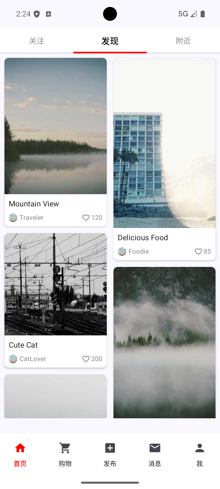
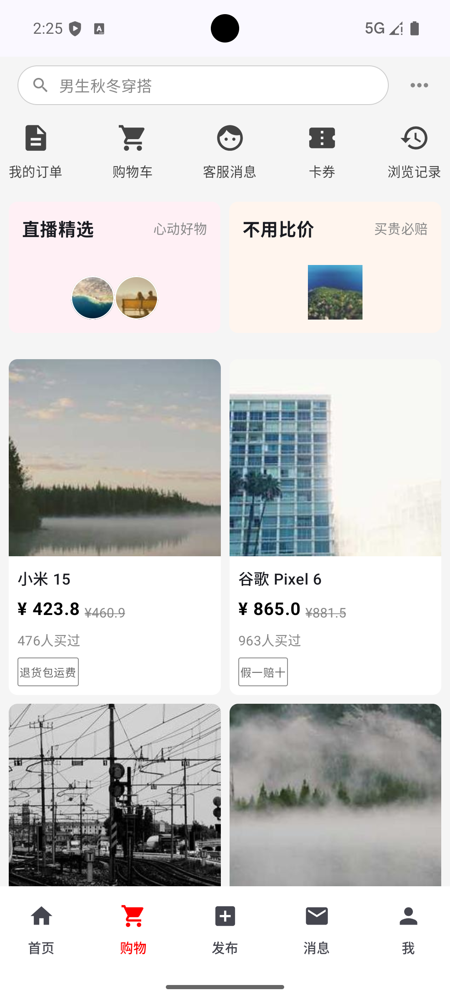
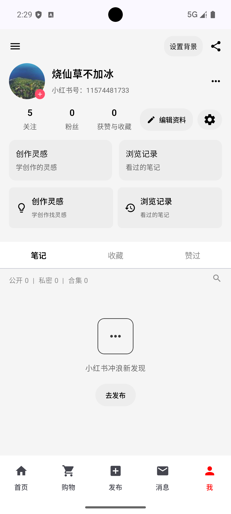

# RedBook 仿小红书 App

本项目使用 Kotlin + Jetpack Compose 构建一个仿小红书的现代化安卓应用，遵循 MVVM 架构与状态驱动的 UI 设计。

## 技术栈
- Kotlin
- Jetpack Compose（Material3）
- Navigation Compose
- Coil（图片加载）
- ViewModel + StateFlow（Kotlin Coroutines）
- Room Database（本地数据持久化）
- DataStore（用户偏好设置）
- OkHttp & WebSocket（实时通信）
- Node.js（本地 Mock 服务器）
- Gradle 8.13

## 已实现功能
- 底部导航：Home / Shopping / Message / Me 四大模块
- 首页
  - 纵向滚动
  - 瀑布流布局（LazyVerticalStaggeredGrid）
  - 标签页结构与内容分区
- 购物
  - 顶部搜索栏与更多入口
  - 图标导航与促销卡片
  - 商品瀑布流列表（图片、标题、价格、销量、标签）
- 消息
  - **实时消息推送**：基于 WebSocket 的全双工通信，支持连接状态管理与断线重连。
  - **消息通知**：App 内 Snackbar 弹窗提示与消息列表实时更新。
  - 顶部操作栏（搜索、添加）
  - 快捷入口（赞和收藏、新增关注、评论和@）
  - 空状态与「你可能感兴趣的人」推荐列表
- 我
  - 个人资料（头像、昵称、小红书号）
  - 数据统计（关注、粉丝、获赞与收藏）
  - 快捷卡片（创作灵感、浏览记录）
  - 标签页（笔记、收藏、赞过）与空状态
- 架构与工程
  - MVVM 模式，UI 与数据逻辑解耦
  - 以 StateFlow 驱动 Compose UI 状态
  - Gradle Wrapper 升级至 8.13，兼容最新 AGP

## 待实现功能
- 登录/注册与账号体系
- 与后端 API 对接（列表分页、错误处理、重试机制）
- 笔记详情页、商品详情页
- 图片视频上传与编辑流程（已实现基础选图）
- 搜索输入与结果页（联想、过滤、排序）
- 购物车与订单管理
- 国际化与无障碍适配
- 单元测试与 UI 测试、CI/CD 集成

## 项目亮点
- **实时通信能力**：自建 `WebSocketManager` 网络层封装，结合 Node.js 本地服务，实现了完整的客户端-服务端实时消息推送链路。
- **现代化架构**：采用 MVVM + Repository 模式，配合手动依赖注入（AppContainer），职责分明，易于测试。
- **数据持久化**：集成 Room 数据库处理结构化数据（笔记、商品），使用 DataStore 管理用户偏好（深色模式）。
- **原生体验**：利用 Activity Result API 实现丝滑的本地相册访问与图片选择功能。
- **纯 Compose UI**：完全基于 Jetpack Compose 构建，状态驱动 UI（StateFlow），实现瀑布流、吸顶 Tab 等复杂交互。
- **工程规范**：模块边界清晰，遵循单一数据源原则，代码可读性与可维护性强。

## 项目截图（占位）
请将实际截图替换下方占位路径并提交到仓库中。

### 首页

### 购物

### 消息

### 我

